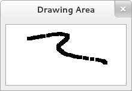

# 绘制

很多控件，例如按钮，是由自己完成所有的绘制工作的，你只需要告诉他们你想要看到的
标签(译者注：label 暂时没想到合适的翻译)、然后他们找出要使用的字体，并绘制按钮
外框和聚焦框等。有的时候需要自定义绘制，这种情况下，GtkDrawingArea 控件就是正确
的选择啦，他提供了一个通过连接 “draw” 信号进行绘制的画布。

一个控件的内容经常需要局部或者全部重绘，例如，当另一个窗口移动让控件的一部分显
示出来，或者当包含控件的窗口大小有了改变。另外也可以通过调用 `Gtk.Widget.queue_draw()` 
或变体显示的让部分或全部控件进行重绘。GTK+ 为 `draw` 信号处理器提供了一个现成的
cairo 上下文用于照顾众多的绘制细节。

下面的程序展示了一个 draw 信号的处理器。比前面的例子要略复杂，因为他还通过处理 
button-press 和 motion-notify 信号的方法掩饰了输入事件的处理过程。



**Example 3. Drawing in response to input**

创建一个如下内容的文件 example-3.py

```python
#!/usr/bin/env python3

from gi.repository import Gtk, Gdk
import cairo

# 用来存储当前涂鸦的表面
surface = None

def clear_surface():
    global surface

    cr = cairo.Context(surface)
    
    cr.set_source_rgb(1, 1, 1)
    cr.paint()

    del cr

# 创建一个大小合适的新表面来存储涂鸦
def configure_event_cb(wid ,evt):
    global surface

    if surface is not None:
        del surface
        surface = None

    win = wid.get_window()

    surface = win.create_similar_surface(
        cairo.CONTENT_COLOR,
        wid.get_allocated_width(),
        wid.get_allocated_height())

    # 初始化绘制表面为空白
    clear_surface()
    
    # 我们已经处理配置了事件，不需要进行下一步的处理
    return True


# 重绘绘制表面。注意 draw 接收一个现成的已被剪切到只有控件需要绘制的部分的 cairo。
def draw_cb(wid, cr):
    global surface

    cr.set_source_surface(surface,0,0)
    cr.paint()
    return False

# 在给定的位置绘制一个矩形
def draw_brush(wid,x,y):
    global surface
    
    # 绘制到我们用来存储状态的 surface 上
    cr = cairo.Context(surface)
    cr.set_source_rgb(0,0,0)
    cr.rectangle(x-3,y-3,6,6)
    cr.fill()
    del cr
    
    # 现在受影响的绘制区域无效。
    wid.queue_draw_area(x-3,y-3,6,6)

# 无论是要绘制一个矩形或者清除这个 surface，处理按钮按下事件，取决于那个按钮被按下。
# button-press 信号处理器接收一个包含这些信息的 GdkEventButton 结构体。
def button_press_event_cb(wid, evt):
    global surface

    # 进行 paranoia 检查，例如在我们没有得到一个配置好的事件情况下
    if surface is None:
        return False

    if evt.button == Gdk.BUTTON_PRIMARY:
        draw_brush(wid,evt.x,evt.y)
    elif evt.button == Gdk.BUTTON_SECONDARY:
        clear_surface()
        wid.queue_draw()

    # 我们已经处理了这个事件，停止处理
    return True


# 处理移动事件，如果按钮 1 一直被按下，则持续的进行绘制。motion-notify 
# 信号处理器接收一个包含这些信息的 GdkEventMotion 结构体
def motion_notify_event_cb(wid,evt):
    global surface
    
    # 进行 paranoia 检查，例如在我们没有得到一个配置好的事件情况下
    if surface is None:
        return False

    if evt.state & Gdk.EventMask.BUTTON_PRESS_MASK:
        draw_brush(wid,evt.x,evt.y)

    # 我们已经处理了这个事件，停止处理
    return True


def close_window(wid):
    global surface

    if surface is not None:
        del surface
        surface = None

    Gtk.main_quit()


if __name__ == '__main__':
    win = Gtk.Window()
    win.set_title('Drawing Area')
    win.connect('destroy',close_window)
    win.set_border_width(8)

    frame = Gtk.Frame()
    frame.set_shadow_type(Gtk.ShadowType.IN)
    win.add(frame)

    da = Gtk.DrawingArea()
    # 设置一个最小大小
    da.set_size_request(100,100)
    frame.add(da)

    # 用于处理后段 surface 的信号
    da.connect('draw',draw_cb)
    da.connect('configure-event',configure_event_cb)

    # 事件信号
    da.connect('motion-notify-event',motion_notify_event_cb)
    da.connect('button-press-event',button_press_event_cb)
    
    # 请求接收事件，绘图区域通常不会订阅这些事件。特别是我们想要请求处理的的是
    # 按钮按下和移动通知事件。
    da.set_events(da.get_events() | Gdk.EventMask.BUTTON_PRESS_MASK | Gdk.EventMask.POINTER_MOTION_MASK)

    win.show_all()
    Gtk.main()
```

然后在中终端中输入命令运行：

```shell
python3 example-1.py
```
