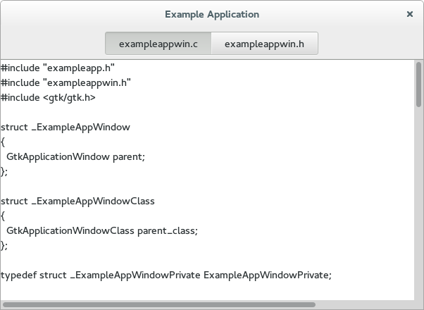

# 打开文件

这一步中，我们要让程序显示在命令行中给出的所有文件的内容。

这里我们要使用到 `stack`，在 GTK+ C 语言中可以使用 `gtk_widget_class_bind_template_child_private()`
来动态的绑定模版中实例化的 `stack` 到自定义的私有结构体中，但是 Python 我翻便 API 文档都没找
到对应的方法，所以我这里欢乐另一种方法：遍历容器的子元素来进行查找并赋值：

```python
def get_object_by_name(self, widget, name):
    if isinstance(widget, Gtk.Container) is not True:
        return None
    else:
        lists = widget.get_children()
        for list in lists:
            list_name = Gtk.Buildable.get_name(list)
            if list_name == name:
                return list
            else:
                result = self.get_object_by_name(list, name)
                if result is not None:
                    return result
```

>PS: 如果大家找到原生 API 支持，请留言，我将修改此段的实现

现在我们重新看一下在使用命令行参数时都会被调用到的 `example_app_window_open` 函数，然后我们要构建一个 `Gtk.TextView`
，用来在 `stack` 中显示内容。

```python
def example_app_window_open(win, file):
    basename = file.get_basename()
    
    scrolled = Gtk.ScrolledWindow()
    scrolled.set_hexpand(True)
    scrolled.set_vexpand(True)
    scrolled.show()
        
    view = Gtk.TextView()
    view.set_editable(False)
    view.set_cursor_visible(False)
    view.show()
    
    scrolled.add(view)
    win.stack.add_titled(scrolled, basename, basename)
    
    result = file.load_contents()
    isLoaded = result[0]
    contents = result[1].decode('utf-8')
    if isLoaded:
        buffer = view.get_buffer()
        buffer.set_text(contents)
        
    del(file)
```

需要注意的是，我们不需要直接接触 stack switcher，他会从所属的 stack 中取得所需信息（编者注：
其实在 ui 文件中已经将其和 stack 进行了绑定）。在这里，我们将需要每个文件需要显示的 label 通
过 `Gtk.Widget.Stack.add_titled()` 方法的最后一个参数传递过去。

程序打开后是这样子的：


