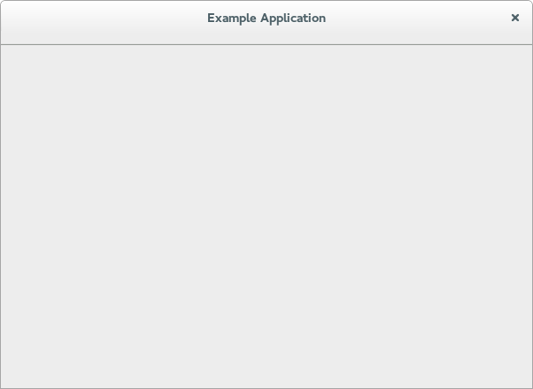

# 填充窗口

在这一步中，我们使用 GtkBuilder 模板将一个 GtkBuilder ui 文件和程序窗口类进行联结。

这个简单的 ui 文件，将一个 GtkHeaderBar 放在 GtkStack 控件的顶部。这个 header bar 包含一
个 GtkStackSwitcher，也就是一个用于显示一行窗口页面 tab 的独立控件。

```xml
<?xml version="1.0" encoding="UTF-8"?>
<interface>
  <!-- interface-requires gtk+ 3.8 -->
  <template class="__main__+ExampleAppWindow" parent="GtkApplicationWindow">
    <property name="title" translatable="yes">Example Application</property>
    <property name="default-width">600</property>
    <property name="default-height">400</property>
    <child>
      <object class="GtkBox" id="content_box">
        <property name="visible">True</property>
        <property name="orientation">vertical</property>
        <child>
          <object class="GtkHeaderBar" id="header">
            <property name="visible">True</property>
            <child type="title">
              <object class="GtkStackSwitcher" id="tabs">
                <property name="visible">True</property>
                <property name="margin">6</property>
                <property name="stack">stack</property>
              </object>
            </child>
          </object>
        </child>
        <child>
          <object class="GtkStack" id="stack">
            <property name="visible">True</property>
          </object>
        </child>
      </object>
    </child>
  </template>
</interface>
```

> ps：由于 python 中的类名为 `__main__+ExampleAppWindow`，所有上面中就有了 
> ``class="__main__+ExampleAppWindow"`（让我有点不习惯啊）。

要在程序中使用这个文件，我们回到 GtkApplicaionWindow 子类，并在类的初始化函数中调用 
`Gtk.Widget.set_template_from_resource()` 来将这个 ui 文件设置为类的 ui 模板。我们也在
这个实例的初始化方法中调用 `Gtk.Widget.init_template()` 为每个实例实例化这个模板。

```python
...

class ExampleAppWindow(Gtk.ApplicationWindow):
   def __init__(self, app):
      Gtk.Window.__init__(self, application=app)
      self.set_template_from_resource('/org/gtk/exampleapp/window.ui')
      self.init_template()

...
```

([完整代码](../code/chapter1/application2/exampleapp.py)

估计你也注意到了我们使用了 `_from_resource` 这样的方法来设定一个模板。现在我们需要使用 GLib 
的资源功能来包含这个 ui 文件到二进制文件中（注：这是指的 C 中，python 中不会编译到二进制文件
中，你懂得）。这一般是通过将所有的资源列举中一个 .gresource.xml 的文件中完成的，例如：

```xml
<?xml version="1.0" encoding="UTF-8"?>
<gresources>
  <gresource prefix="/org/gtk/exampleapp">
    <file preprocess="xml-stripblanks">window.ui</file>
  </gresource>
</gresources>
```

使用 glib-compile-resources 来编译这个资源文件：

```shell
glib-compile-resources exampleapp.gresource.xml
```

我们的程序现在看起来是这样的：


